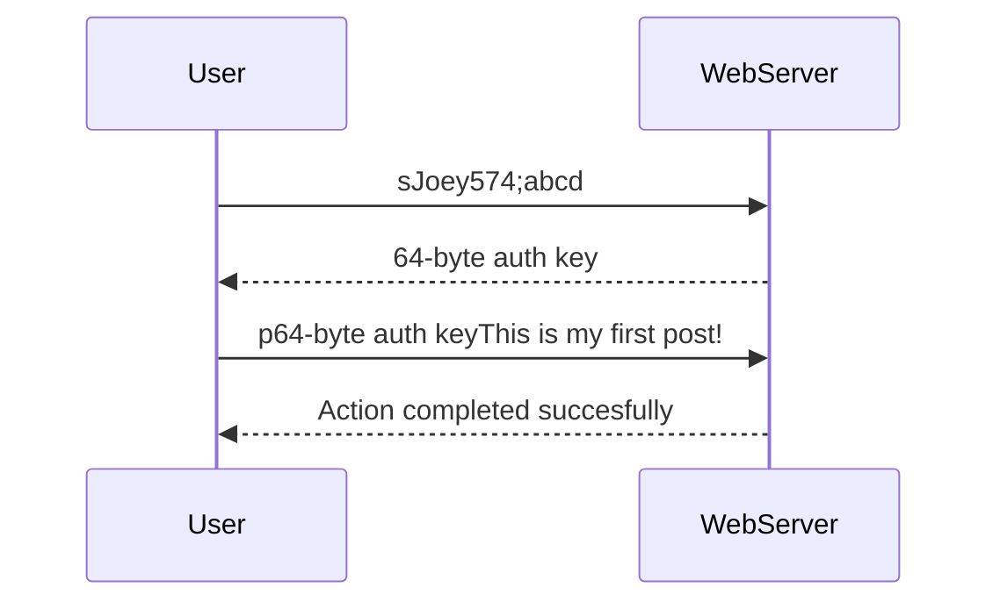

# Joey Soroka
Computer Science, Bellevue College
 
1-(425)-996-2135 | joeysoroka@outlook.com

## Education
### Cedarcrest High School

### Bellevue College

## Skills
* **Languages:** C/C++, CUDA, Python, C#, Java, Js, asm, Bash, hlsl
* **Libraries:** OpenGL, Tensorflow, Pandas, Seaborn, Numpy
* **Game Engines:** Unity, Unreal
* **Concepts:** Machine Learning, Data Structures, Algorithms, Game Design, Optimization, Web Development, Cybersecurity
* **Other:** Linux

## Projects
#### [Game Of Life in Unity](https://github.com/Joey574/GameOfLifeInUnity) | **Conways Game of Life Simulation**
* A game written in C# and making use of hlsl in Unity to simulate conway's game of life
* Includes various other spinoffs of conway's game of life, like wireworld, highlife, and many others
* **Skills:** C#, hlsl, Unity, Game Design, Data Structes, Algorithms

// TODO: attach gif

#### [N-Body Simulation](https://github.com/Joey574/NBodySimulation) | **Physics Body Simulation**
* A simulation written in C++, uses CUDA to handle computations and OpenGL to render to a window
* **Skills:** C++, OpenGL, CUDA, Data Structures, Algorithms, Physics

#### [Messaging-board](https://github.com/Joey574/Messaging-Board) | **Messaging board in asm**
* A simple messaging board web-server written in asm for linux
* Implements its own communication protocol, although perhaps in the future I'll make an http complient one
*  **Skills:** asm, Linux, Web Development, Cybersecurity

*There's much more a user can do, this is just an example*

#### [Dive Game Basic Scripting](https://github.com/Joey574/DiveGameBasicScripting) | **Diving Physics Simulation**
* A simulation in Unity that mimicks real word gas behaviour divers experience while underwater
* Uses the ZH-L16 Algorithm
* **Skills:** C#, Unity, Algorithms, Physics

The equation for ZH-L16 is as follows:
 
**P = Pio + R(t - 1/k) - (Pio - Po - (R/k)) e-kt**

#### [Machine-Learning Cpp](https://github.com/Joey574/MachineLearningCpp) | **Various Neural Network Frameworks**
* Includes various NN frameworks, datasets, and other related projects written from scratch
*  **Skills:** C++, CUDA, SIMD, Multithreading, Data Structures, Algorithms, Linear-Algebra, Machine Learning, AI

#### [OpenGL Projects](https://github.com/Joey574/OpenglProjects) | **Various OpenGL Projects**
* Includes various OpenGL projects
  * 2D Games
  * Realtime Fractal rendering
*  **Skills:** C++, Algorithms, Game Design, SIMD, Multithreading, Linear-Algebra, Math

// TODO: more gif

## Notable Repos
While not really singular projects I ever plan on 'releasing' there are some more repos I believe demonstrate my skills / ability well.

#### [Learning MASM](https://github.com/Joey574/LearningMASM) | **Various Beginner MASM Projects**
* Includes various beginner/intermediate MASM projects
* Most projects are beginner focused, however, intermediate concepts like self-modifying code are also included
*  **Skills:** asm

#### [Cpp Advanced Projects](https://github.com/Joey574/Cpp-Advanced-Projects) | **Various C++ Projects**
* This is more of a general repo containing
  * Sorting Algorithms
  * Matrix Multiplication
  * Multithreading
  * 2D Games
* **Skills:** C++, Algorithms, Game Design, SIMD, Multithreading, Data Structures

## Other Projects on
* **[kaggle.com](https://www.kaggle.com/joeyleesoroka)**
* **[pwn.college](https://pwn.college/hacker/78956)**
